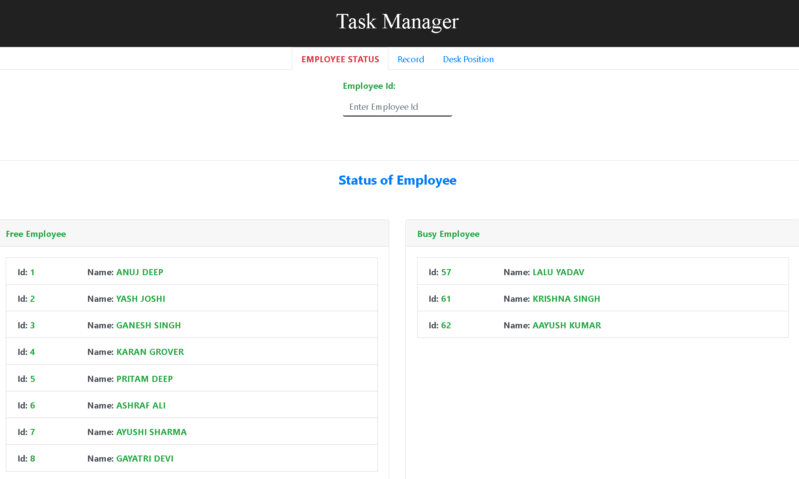
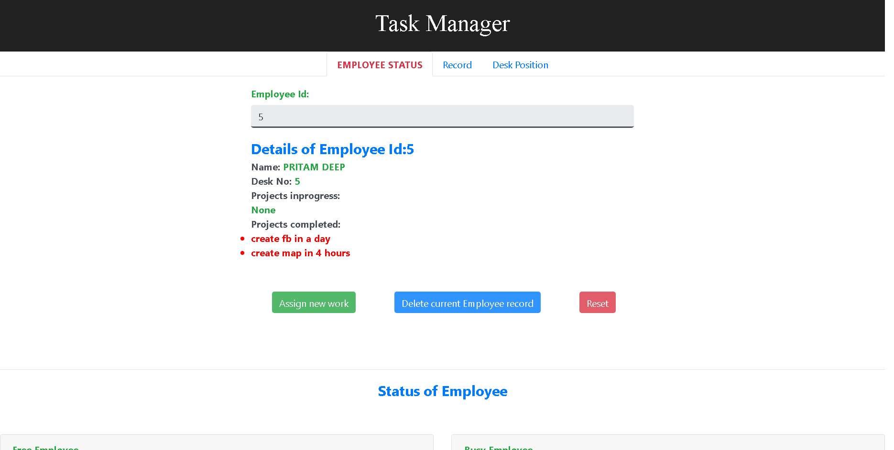
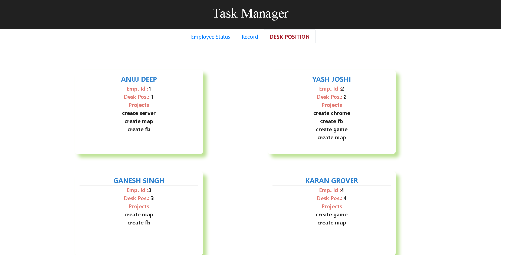
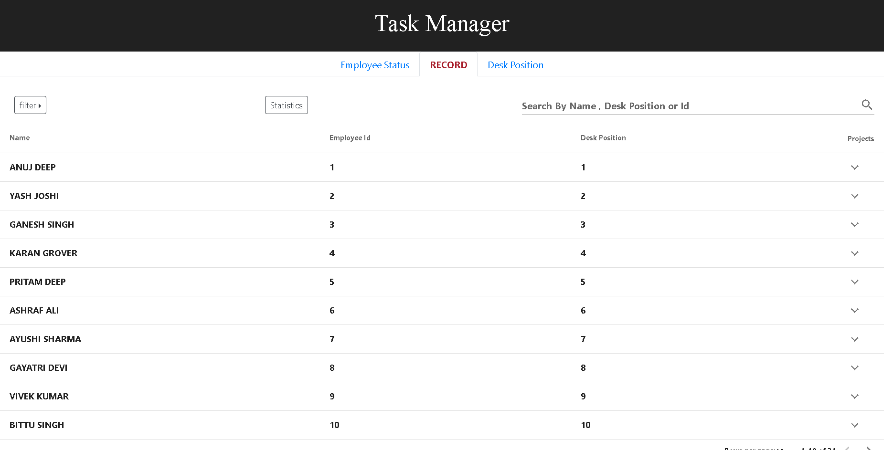
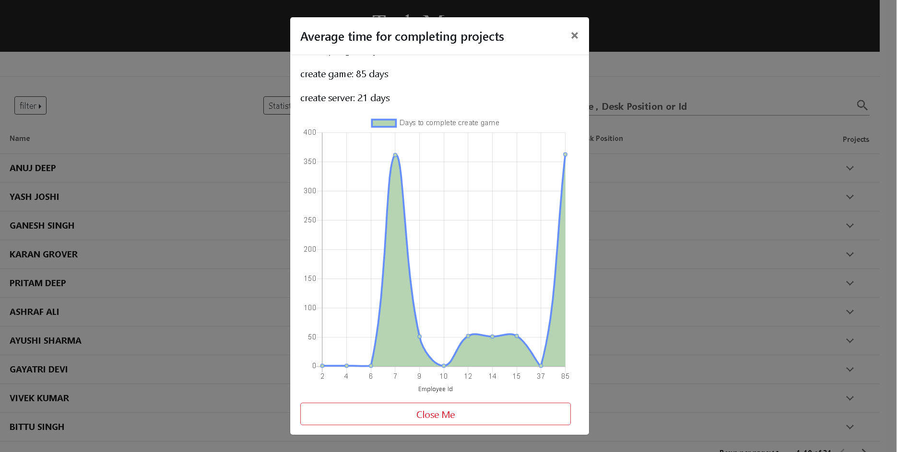

# task_manager

A MEVN based web app used to track progress and completion of projects by employee of a company.

You can use the app to know which employees are free or busy in their projects and what is their average project completion time.

Chart.js is used to compare completion time for a project by employees.

